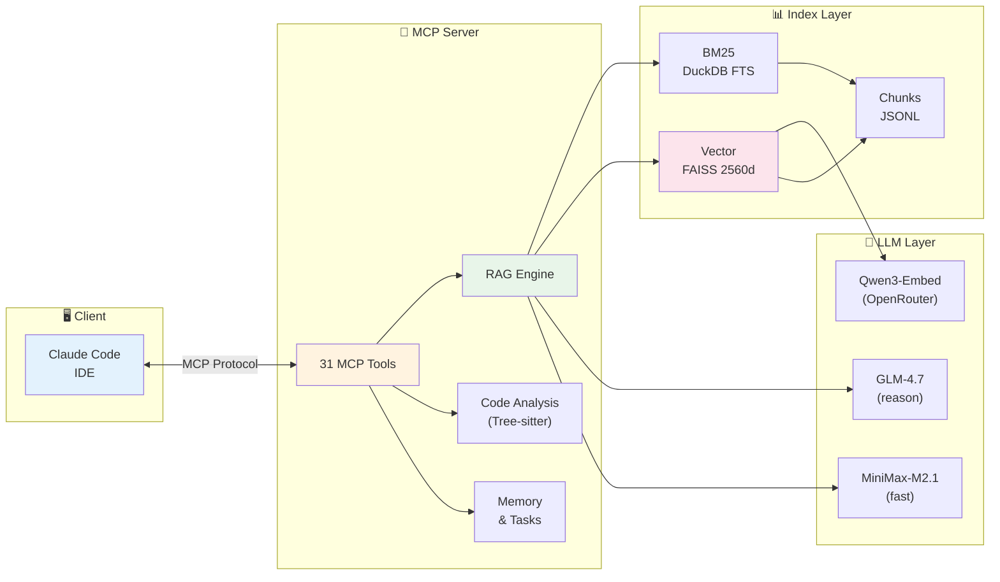
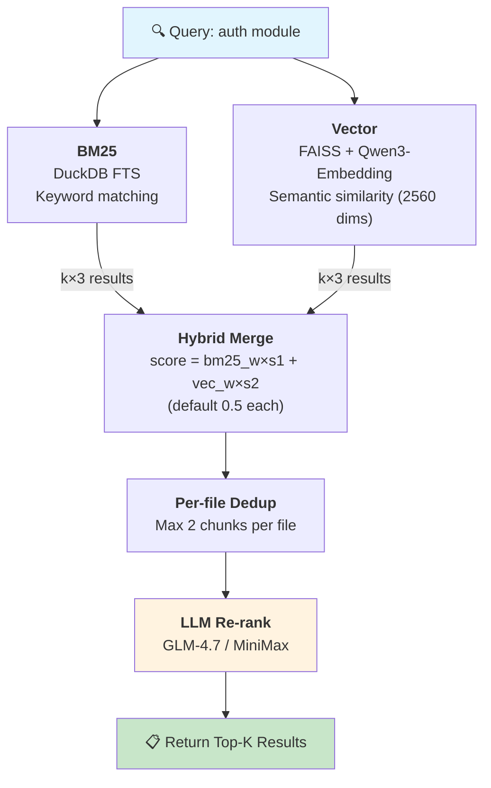

# augment-lite-mcp

> **Zero-Maintenance AI Code Assistant** - Local-first, cost-effective, privacy-safe

[](https://github.com/zoonderkins/augment-lite-mcp/releases)
[](https://opensource.org/licenses/MIT)
[](https://www.python.org/downloads/)
[](https://github.com/anthropics/mcp)

**[中文文檔](README_ZH.md)**

---

## 🎯 What is augment-lite-mcp?

augment-lite-mcp is a **zero-maintenance, local-first** AI code assistant engine that integrates with AI programming tools like Claude Code via MCP (Model Context Protocol).

### 💡 Core Value Proposition

```
Zero-Maintenance Search + Local Privacy + Low-Cost AI = Ideal Programming Assistant
```

- **🔥 Zero Maintenance**: Auto-incremental indexing, no manual rebuild required
- **🔒 Privacy First**: Code stored entirely locally (DuckDB + SQLite)
- **💰 Cost Effective**: Local BM25+Vector first, LLM only for final filtering
- **🎯 Hybrid Search**: BM25 keywords + vector semantic dual matching

### 🏗️ System Architecture



---

## ✨ Core Features

### 1. 🚀 Auto-Incremental Indexing
**acemcp-inspired Zero-Maintenance Experience**

```bash
# No manual rebuild needed, everything happens automatically
./scripts/manage.sh add auto .  # Initial project add

# After any code modifications
# Changes are auto-detected and indexed on search
```

- ✅ Auto-detect file changes (mtime + MD5)
- ✅ Only update changed files (60x faster)
- ✅ Completely transparent, no user intervention

### 2. 🔍 Dual-Layer Retrieval
**Local Vector + Remote LLM Smart Filtering**

```
Layer 1: Vector Embeddings (OpenRouter API / Local fallback)
  → BM25 + Vector hybrid search (k×3 over-fetch)
  → ~50 candidates → per-file dedup → ~35 candidates
  → Model: qwen/qwen3-embedding-4b (2560 dims, API)
  → Fallback: all-MiniLM-L6-v2 (384 dims, local)

Layer 2: GLM-4.7 / MiniMax-M2.1 LLM Smart Filtering
  → Semantic understanding + Re-rank
  → Final Top-K high-quality results
  → Uses OpenAI-compatible API format
```

**Advantages**:
- Local-first: BM25+Vector computed locally, no API costs
- LLM filtering: Only candidate results sent to LLM, reduced token consumption
- Optional fallback: Auto-fallback to pure BM25 when Vector not installed

**Model Selection**: Multiple embedding models supported, see [Vector Models Comparison](docs/core/COMPARISON.md#vector-embedding-models-比較)

#### BM25 + Vector Technical Details



| Component | Implementation | Features |
|-----------|---------------|----------|
| **BM25** | DuckDB FTS | Exact keyword matching, zero latency |
| **Vector** | FAISS + sentence-transformers | Semantic understanding, cross-language |
| **Hybrid** | Weighted fusion | Balance precision and semantics |

#### Technical Parameters

| Category | Configuration | Description |
|----------|--------------|-------------|
| **Vector Store** | FAISS (`IndexFlatIP`) | Inner product index + L2 normalize = cosine similarity |
| **Embedding** | `qwen/qwen3-embedding-4b` (2560 dims) | OpenRouter API, fallback to local 384 dims |
| **Dimension Check** | ✅ Fail-fast | Error immediately on unexpected API dimensions |
| **Chunk (Code)** | 50 lines / 10 lines overlap | `.py`, `.js`, `.go`, `.rs` and 50+ extensions |
| **Chunk (Docs)** | 256 tokens / 32 tokens overlap | `.md`, `.txt`, `.rst`, `.html` etc. |
| **TopK (hybrid)** | **k×3** (BM25 + Vector each fetch 3x) | Merge → per-file dedup → re-rank |
| **Per-file Dedup** | ✅ Max 2 chunks per file | Balance recall vs redundancy |
| **Max File Size** | 1 MB | Larger files auto-skipped |

<details>
<summary>📊 Query Flow Diagram (v1.3.3+)</summary>

```
BM25: k*3 = 30 results
Vector: k*3 = 30 results
       ↓ Merge + dedup (by source)
    ~50-60 candidates
       ↓ Per-file dedup (max 2 chunks per file)
    ~35-50 candidates
       ↓ Re-rank (LLM subagent)
    Return top-10
```
</details>

<details>
<summary>📁 Supported File Types (70+)</summary>

**Code** (line-based chunking):
- Python: `.py`, `.pyw`, `.pyi`, `.pyx`
- JavaScript/TypeScript: `.js`, `.jsx`, `.ts`, `.tsx`, `.mjs`, `.cjs`
- Go: `.go` | Rust: `.rs` | Java: `.java` | Kotlin: `.kt`, `.kts`
- C/C++: `.c`, `.h`, `.cpp`, `.cc`, `.hpp`, `.hxx`
- C#: `.cs` | Ruby: `.rb` | PHP: `.php` | Swift: `.swift`
- Shell: `.sh`, `.bash`, `.zsh` | SQL: `.sql`
- Config: `.yaml`, `.yml`, `.toml`, `.json`, `.ini`
- Web: `.vue`, `.svelte`, `.css`, `.scss`
- Infra: `.tf`, `.hcl`, `.dockerfile`, `.proto`

**Docs** (token-based chunking):
- `.md`, `.markdown`, `.txt`, `.rst`, `.html`, `.adoc`, `.org`, `.tex`
</details>

**Fallback Mechanism**:
- Vector dependencies not installed → Auto-fallback to pure BM25
- Vector index doesn't exist → Auto-fallback to pure BM25

### 3. 📁 Multi-Project Management
**Flexible Project Organization**

```bash
# Three ways to specify a project
./scripts/manage.sh add myproject /path/to/project  # By name
./scripts/manage.sh rebuild 45d8fb52                # By ID (8 chars)
./scripts/manage.sh add auto .                      # Auto-detect

# Claude Code auto-uses current working directory project
# No manual switching required
```

### 4. 💾 Advanced Caching
**Multi-Layer Cache Architecture**

- **Exact Cache** (SQLite): Direct return for exact query matches
- **Semantic Cache** (FAISS): Cosine similarity matching for similar queries
- **LLM Cache**: API response caching (reduces repeated calls)

**Advantage**: Repeated queries return instantly, no recomputation

### 5. 🧠 Memory & Tasks
**Long-term Memory + Task Tracking**

```python
# Long-term memory (persists across sessions)
memory.set("api_key", "secret_value", project="myproject")
memory.get("api_key")

# Task management
task.add("Implement feature X", priority=10)
task.list(status="in_progress")
```

### 6. 🌐 Web UI (v0.7.0)
**Professional Management Interface**

```bash
cd web_ui && ./start.sh  # http://localhost:8080
```

- ✅ Real-time log streaming (WebSocket)
- ✅ Interactive search testing
- ✅ Project dashboard
- ✅ Modern dark theme

### 7. 🤖 MCP Protocol Compliance
**31 MCP Tools**

| Category | Tools |
|----------|-------|
| **RAG** | `rag.search`, `answer.generate`, `answer.accumulated`, `answer.unified` |
| **Dual Search** | `dual.search` |
| **Project** | `project.init`, `project.status` |
| **Index** | `index.status`, `index.rebuild` |
| **Cache** | `cache.clear`, `cache.status` |
| **Memory** | `memory.get`, `memory.set`, `memory.delete`, `memory.list`, `memory.clear` |
| **Tasks** | `task.add`, `task.list`, `task.update`, `task.get`, `task.delete`, `task.resume`, `task.current`, `task.stats` |
| **Code** | `code.symbols`, `code.find_symbol`, `code.references` |
| **Search** | `search.pattern` |
| **File** | `file.read`, `file.list`, `file.find` |

### 8. 🔄 Unified Search (v1.3.2+)
**auggie + augment-lite Multi-Engine Orchestration**

```
┌─────────────────────────────────────────────────────────────┐
│               answer.unified (Orchestrator Tool)            │
│                                                              │
│  1. [minimax-m2.1] Decompose query → sub_queries            │
│  2. Return execution plan to Claude                         │
└──────────────────────┬──────────────────────────────────────┘
                       ↓
┌─────────────────────────────────────────────────────────────┐
│              Claude Executes Plan Automatically              │
│                                                              │
│  Step 1: auggie-mcp → semantic_results                      │
│  Step 2: rag.search [minimax re-rank] → rag_results         │
│  Step 3-N: rag.search (sub-queries) → more_results          │
│  Step N+1: Merge evidence → [GLM-4.7] → final_answer        │
└─────────────────────────────────────────────────────────────┘
```

| Tool | Trigger | Model Calls |
|------|---------|-------------|
| `answer.accumulated` | Complex questions, previous "don't know" | minimax (decompose) → GLM-4.7 (answer) |
| `answer.unified` | Need auggie + augment-lite dual engine | minimax (decompose) + auggie + GLM-4.7 |
| `dual.search` | Only need search results, no answer generation | minimax (re-rank) |

**Auto-Rebuild Feature (v1.3.2+)**

When `dual.search` detects >50% of auggie's returned files are missing from augment-lite results, auto-triggers `incremental_index` rebuild and re-searches:

```json
{
  "index_rebuilt": true,
  "rebuild_info": {
    "files_updated": 15,
    "reason": "auggie found files missing from augment-lite index"
  }
}
```

| Parameter | Default | Description |
|-----------|---------|-------------|
| `auto_rebuild` | `true` | Auto-rebuild stale index |

---

## 📦 Quick Start

### Installation

```bash
# 1. Clone repository
git clone https://github.com/zoonderkins/augment-lite-mcp.git
cd augment-lite-mcp

# 2. Install dependencies (using uv)
uv venv .venv
source .venv/bin/activate
uv pip install -r requirements.txt

# Or using standard Python
# python3 -m venv .venv && source .venv/bin/activate
# pip install -r requirements.txt

# 3. Configure API Keys
cp .env.example .env
# Edit .env and fill in required API Keys:
#   - GLM_API_KEY (from z.ai)
#   - MINIMAX_API_KEY (from minimax.io)
#   - OPENROUTER_API_KEY (from openrouter.ai/keys) - for Embeddings

# 4. (Optional) Install vector search dependencies (~2GB)
bash scripts/install_vector_deps.sh

# 5. Add project and build index
./scripts/manage.sh add auto .
```

### Configure MCP

#### Method 1: Claude MCP CLI (Recommended)

```bash
# One-command setup with Claude MCP CLI
claude mcp add --scope user --transport stdio augment-lite \
  --env AUGMENT_DB_DIR="$HOME/augment-lite-mcp/data" \
  --env GLM_API_KEY="your-glm-api-key" \
  --env MINIMAX_API_KEY="your-minimax-api-key" \
  --env OPENROUTER_API_KEY="your-openrouter-api-key" \
-- "$HOME/augment-lite-mcp/.venv/bin/python" \
     "-u" "$HOME/augment-lite-mcp/mcp_bridge_lazy.py"
```


#### Method 2: Manual JSON Configuration

Edit `~/.claude/config.json`:

```json
{
  "mcpServers": {
    "augment-lite": {
      "command": "/absolute/path/to/.venv/bin/python",
      "args": ["-u", "/absolute/path/to/mcp_bridge_lazy.py"],
      "env": {
        "AUGMENT_DB_DIR": "/absolute/path/to/data",
        "GLM_API_KEY": "your-glm-api-key",
        "MINIMAX_API_KEY": "your-minimax-api-key",
        "OPENROUTER_API_KEY": "your-openrouter-api-key"
      }
    }
  }
}
```

**Environment Variables**:

| Variable | Required | Description |
|----------|----------|-------------|
| `AUGMENT_DB_DIR` | ✅ | Data directory (index, cache, memory) |
| `GLM_API_KEY` | ✅ | GLM-4.7 API Key (from z.ai) |
| `MINIMAX_API_KEY` | ✅ | MiniMax-M2.1 API Key (from minimax.io) |
| `OPENROUTER_API_KEY` | ✅ | OpenRouter API Key (from openrouter.ai/keys) - for Embeddings |

> **Embedding Note**: Uses OpenRouter to call `qwen/qwen3-embedding-4b` (2560 dims). If `OPENROUTER_API_KEY` not set, auto-fallback to local `all-MiniLM-L6-v2` (384 dims).

#### Method 3: Local Proxy Mode (Optional)

If using [claude-code-proxy](https://github.com/anthropics/claude-code-proxy) local proxy:

```json
{
  "env": {
    "GLM_LOCAL_BASE_URL": "http://127.0.0.1:8082/v1",
    "GLM_LOCAL_API_KEY": "dummy",
    "GLM_LOCAL_MODEL_ID": "GLM-4.7",
    "MINIMAX_LOCAL_BASE_URL": "http://127.0.0.1:8083/v1",
    "MINIMAX_LOCAL_API_KEY": "dummy",
    "MINIMAX_LOCAL_MODEL_ID": "MiniMax-M2.1"
  }
}
```

Then modify `config/models.yaml` routes to use `glm-local` / `minimax-local`

### Usage

```python
# In Claude Code
# AI automatically uses augment-lite MCP tools

# Search code
"Help me find the user login handling code"

# Generate answers (with citations)
"How do I configure the database connection?"

# Manage tasks
"Add task: Refactor authentication module"
```

---

## 🚀 First-Time Initialization

When you first run Claude CLI in a project directory, augment-lite automatically:

```
1. Project Detection
   └─ Auto-identifies current working directory as project

2. Index Building (offline)
   ├─ BM25 index (DuckDB) - keyword search
   └─ Vector index (FAISS) - semantic search (optional)

3. Cache Initialization
   ├─ Exact cache (SQLite)
   └─ Semantic cache (FAISS)

4. Memory Initialization
   └─ Long-term memory (SQLite)
```

**Manual Initialization:**
```bash
./scripts/manage.sh add auto .
```

---

## 🔄 Execution Flow

### Auto-Init + Auto-Index Complete Flow

When you execute any RAG operation (like `rag.search`), augment-lite handles everything automatically:

```
┌─────────────────────────────────────────────────────────┐
│                    User executes rag.search             │
└─────────────────────────┬───────────────────────────────┘
                          │
                          ▼
┌─────────────────────────────────────────────────────────┐
│              resolve_auto_project()                      │
│  Priority: 1.Dir name match 2.Path match 3.Active 4.None │
└─────────────────────────┬───────────────────────────────┘
                          │
              ┌───────────┴───────────┐
              │                       │
      Project registered      Project not registered
              │                       │
              │                       ▼
              │         ┌─────────────────────────┐
              │         │      AUTO-INIT          │
              │         │  - Sanitize dir name    │
              │         │  - Register to projects │
              │         │  - Set as active        │
              │         └───────────┬─────────────┘
              │                     │
              └──────────┬──────────┘
                         │
                         ▼
┌─────────────────────────────────────────────────────────┐
│              auto_index_if_needed()                      │
│               Detect file changes                        │
└─────────────────────────┬───────────────────────────────┘
                          │
              ┌───────────┴───────────┐
              │                       │
      Has index state          No index state
              │                       │
              ▼                       ▼
     ┌────────────────┐      ┌────────────────┐
     │  Incremental   │      │  Full build    │
     │  Only process  │      │  All files as  │
     │  changed files │      │  "added"       │
     │  (mtime+MD5)   │      │                │
     └────────┬───────┘      └────────┬───────┘
              │                       │
              └───────────┬───────────┘
                          │
                          ▼
┌─────────────────────────────────────────────────────────┐
│                     Execute Search                       │
│  BM25 + Vector hybrid → LLM filtering → Return results   │
└─────────────────────────────────────────────────────────┘
```

### Key Features

| Feature | Description |
|---------|-------------|
| **Zero Config** | No manual `project.init` needed, first search auto-initializes |
| **Zero Maintenance** | Auto-detect file changes, incremental index updates |
| **Smart Sanitization** | Special chars like `.` in dir names auto-replaced with `-` |
| **Auto Activation** | New projects auto-set as active, no manual switching |

### Execution Order

```bash
# Traditional way (still supported)
project.init → index.rebuild → rag.search

# New way (recommended)
rag.search  # Auto-handles init + index
```

---

## 🔧 Feature Reference

### RAG Features (Offline)

| Tool | Description | Usage |
|------|-------------|-------|
| `rag.search` | BM25 + vector hybrid search | Search code snippets |
| `answer.generate` | Generate answers from retrieval | Answers with citations |
| `answer.accumulated` | Multi-round evidence accumulation | Complex questions, avoid "don't know" |
| `answer.unified` | auggie + augment-lite orchestration | Returns execution plan for Claude |
| `dual.search` | Dual-engine search | Local RAG + auggie hint |
| `index.rebuild` | Rebuild project index | Use when index corrupted |
| `index.status` | Check index status | View index health |

### Code Analysis Features (Serena-like) - Tree-sitter Multi-language Support

| Tool | Description | Example |
|------|-------------|---------|
| `code.symbols` | Get code symbol overview | List classes, functions, methods |
| `code.find_symbol` | Find symbol definition | Find `MyClass` definition location |
| `code.references` | Find symbol references (AST) | Find all usages of `my_func` |
| `search.pattern` | Regex pattern search | `def.*search` matching |
| `file.read` | Read file content | Supports line ranges |
| `file.list` | List directory contents | Supports glob filters |
| `file.find` | Find files | `**/*.py` patterns |

**Supported Languages** (v1.3.0+, Tree-sitter):
```
Python, JavaScript, TypeScript, Go, Rust, Bash,
JSON, YAML, HTML, CSS, HCL (Terraform), TOML
```

### Memory and Tasks

| Tool | Description |
|------|-------------|
| `memory.get/set/delete/list` | Long-term memory management |
| `task.add/list/update/delete` | Task tracking |
| `project.init/status` | Project management |
| `cache.clear/status` | Cache management |

### 🧠 Memory Usage Patterns (Serena-style)

AI **proactively** auto-stores Memory in these situations:

| Trigger Condition | Suggested Key | Example Content |
|-------------------|---------------|-----------------|
| First interaction | `project_overview` | Project name, version, purpose, core modules |
| Code style detected | `code_style` | ruff, 100 chars, Python 3.12+ |
| Read README/docs | `suggested_commands` | setup, build, test commands |
| User explains architecture | `architecture_decisions` | Microservices, GraphQL, Redis cache |
| User mentions deployment | `deployment_notes` | Docker, K8s, environment variables |
| Bug pattern found | `known_issues` | Common errors, workarounds |

**Standard Memory Keys:**
```
project_overview          # Project overview
code_style                # Code style
suggested_commands        # Common commands
architecture_decisions    # Architecture decisions
api_conventions           # API conventions
deployment_notes          # Deployment notes
known_issues              # Known issues
task_completion_checklist # Completion checklist
```

---

## 🔌 Auggie MCP Integration (Optional)

**Save Tokens + Improve Semantic Accuracy**

augment-lite can work collaboratively with [Auggie MCP](https://docs.augmentcode.com/context-services/mcp/quickstart-claude-code):

```
┌──────────────────────────────────────────────────────────┐
│                    Claude Code                            │
└─────────────────┬────────────────────────────────────────┘
                  │
     ┌────────────┴────────────┐
     │                         │
┌────▼────────┐          ┌────▼────────┐
│ augment-lite│          │  auggie-mcp │
│ (BM25 RAG)  │          │ (Semantic)  │
└─────────────┘          └─────────────┘
     │                         │
     └──────────┬──────────────┘
                │
        ┌───────▼───────┐
        │  Merge Results│
        │  Dedup + Sort │
        └───────────────┘
```

### Install Auggie MCP

```bash
# 1. Install auggie CLI
npm install -g @augmentcode/auggie@latest

# 2. Login (requires Augment Code account)
auggie login

# 3. Add to Claude Code
claude mcp add-json auggie-mcp --scope user '{"type":"stdio","command":"auggie","args":["--mcp"]}'
```

### Usage Modes

| Mode | Description | Token Consumption |
|------|-------------|-------------------|
| **augment-lite only** | BM25 + Vector local search | Low |
| **auggie-mcp only** | Augment semantic engine | Lowest |
| **Hybrid mode (Recommended)** | augment-lite initial filter + auggie refinement | Medium |

### Recommended Workflow

```
1. User query "find auth module"
2. augment-lite rag.search → Get 20 candidates
3. auggie-mcp codebase-retrieval → Semantic sort
4. Claude merges results → Return most relevant 5
```

> **Fallback without Auggie**: augment-lite uses built-in LLM filtering (GLM-4.7/MiniMax), can work independently

### 🛡️ Guardrails (v1.2.0)

| Module | Function | Description |
|--------|----------|-------------|
| `prompt_injection` | Prompt injection detection | Prevent instruction override, role hijacking, jailbreak |
| `pii_detection` | PII/sensitive data detection | Email, phone, SSN, API Key, JWT |
| `code_security` | Code security scanning | SQL injection, XSS, command injection, OWASP Top 10 |
| `hallucination` | Hallucination detection | Verify answers are based on provided evidence |
| `context_grounding` | Context grounding | Ensure answers don't exceed provided context |
| `schema_validation` | Output validation | JSON schema validation, MCP output format |

---

## 🔑 Environment Variables

### Required

| Variable | Description | Source |
|----------|-------------|--------|
| `GLM_API_KEY` | GLM-4.7 API Key | [z.ai](https://z.ai) |
| `MINIMAX_API_KEY` | MiniMax-M2.1 API Key | [minimax.io](https://minimax.io) |

### Optional

| Variable | Description | Default |
|----------|-------------|---------|
| `AUGMENT_DB_DIR` | Data directory | `./data` |

### Local Proxy (Optional)

If using claude-code-proxy:

| Variable | Description |
|----------|-------------|
| `GLM_LOCAL_BASE_URL` | `http://127.0.0.1:8082/v1` |
| `GLM_LOCAL_API_KEY` | `dummy` |
| `MINIMAX_LOCAL_BASE_URL` | `http://127.0.0.1:8083/v1` |
| `MINIMAX_LOCAL_API_KEY` | `dummy` |

---

## 🏗️ Architecture Overview

```
┌──────────────────────────────────────────────┐
│            Claude Code (AI Assistant)         │
└─────────────────┬────────────────────────────┘
                  │ MCP Protocol
┌─────────────────▼────────────────────────────┐
│         mcp_bridge_lazy.py (31 Tools)        │
└─────────────────┬────────────────────────────┘
                  │
     ┌────────────┼────────────┐
     │            │            │
┌────▼─────┐  ┌──▼──────┐  ┌─▼────────┐
│ Retrieval│  │  Cache  │  │  Memory  │
│ (BM25+   │  │ (3-Layer│  │ (SQLite) │
│  Vector) │  │  Cache) │  └──────────┘
└────┬─────┘  └─────────┘
     │
┌────▼─────────────────────────────────┐
│  Layer 1: API/Local Embeddings       │
│  - OpenRouter: qwen3-embedding-4b    │
│  - Fallback: sentence-transformers   │
│  - BM25 + FAISS hybrid search        │
│  - 50 candidates                     │
└────┬─────────────────────────────────┘
     │
┌────▼─────────────────────────────────┐
│  Layer 2: Remote LLM Re-ranking      │
│  - GLM-4.7 / MiniMax-M2.1 (native)   │
│  - Smart filtering + deduplication   │
│  - Final 8 results                   │
└──────────────────────────────────────┘
```

### 🤖 Provider Configuration (All Native)

| Provider | Endpoint | Context | Max Output |
|----------|----------|---------|------------|
| **glm-4.7** | `api.z.ai/api/anthropic` | 200K | 128K |
| **minimax-m2.1** | `api.minimax.io/anthropic` | 200K | - |

### 📊 Route Configuration

| Route | Provider | Max Output | Trigger |
|-------|----------|-----------|---------|
| `small-fast` | minimax-m2.1 | 2048 | lookup, small_fix |
| `general` | glm-4.7 | 4096 | general tasks |
| `reason-large` | glm-4.7 | 8192 | refactor, reason |
| `big-mid` | glm-4.7 | 8192 | tokens > 200K |
| `long-context` | glm-4.7 | 8192 | tokens > 400K |
| `ultra-long-context` | glm-4.7 | 16384 | ultra-long context |
| `fast-reasoning` | minimax-m2.1 | 4096 | fast reasoning |

---

## 🎯 Supported Features

### ✅ Implemented

- [x] Auto-incremental indexing (zero maintenance)
- [x] Dual-layer retrieval (local + remote)
- [x] Multi-project management (name/ID/auto)
- [x] Three-layer caching (exact + semantic + provider)
- [x] Long-term memory (global/project scope)
- [x] Task management (structured tracking)
- [x] Web UI (FastAPI + WebSocket)
- [x] MCP protocol compliance (28 tools)
- [x] AI auto-discovery (server instructions)
- [x] Gitignore filtering
- [x] Model-specific system prompts
- [x] Dynamic token limits
- [x] Guardrails (evidence citation)
- [x] Modern Guardrails (v1.2.0)
  - Prompt Injection Detection
  - PII/API Key Detection
  - Code Security Scanning (OWASP)
  - Hallucination Detection
  - Context Grounding Validation
  - Output Schema Validation

### 🚧 Planned (v1.4.0+)

#### Code Understanding Enhancement

| Approach | Functionality | Status |
|----------|--------------|--------|
| **Tree-sitter** | AST structure parsing (12 languages) | ✅ v1.3.0 implemented |
| **Modify Symbol Tools** | rename, edit_symbol_body | 🚧 v1.4.0 planned |
| **LSP Bridge** | Complete semantic analysis | 🚧 v1.5.0 planned |
| **Auggie MCP** | External semantic engine | 🚧 Optional integration |

**Completed (v1.3.0)**:
- [x] **Tree-sitter Integration**: 12 language AST parsing
  - Python, JavaScript, TypeScript, Go, Rust, Bash
  - JSON, YAML, HTML, CSS, HCL (Terraform), TOML
- [x] **AST-based References**: `code.references` uses Tree-sitter for precise location

**v1.4.0 Plan (P85)**:
- [ ] **Modify Symbol Tools** (Serena core gap)
  - `code.rename_symbol` - Scope-aware safe renaming
  - `code.edit_symbol_body` - Precise symbol content replacement
  - `code.insert_before_symbol` / `code.insert_after_symbol`
  - Initial approach: AST-based Python-only version

**v1.5.0 Plan (P80)**:
- [ ] **LSP → MCP Bridge**: Complete semantic analysis
  - rename (cross-file safe refactoring)
  - diagnostics (lint/errors)
  - code actions
  - Approach: Integrate mcp-language-server or build LSP client wrapper

**Research (P70)**:
- [ ] **Auggie MCP Deep Integration**: Evaluate as LSP alternative
  - Install: `npm install -g @augmentcode/auggie@latest && auggie login`
  - Config: `claude mcp add-json auggie-mcp --scope user '{"type":"stdio","command":"auggie","args":["--mcp"]}'`

#### Other Plans

- [ ] Multi-language embeddings (multilingual-e5-large)
- [ ] Code-specific embeddings (CodeBERT, UniXcoder)
- [ ] GraphRAG integration (code dependency graphs)
- [ ] Incremental vector index updates
- [ ] Cloud deployment options (Docker Compose)
- [ ] VSCode extension (alternative to MCP)
- [ ] Monitoring dashboard (metrics, usage stats)
- [ ] Plugin system (custom tools)

---

## 📊 Performance Characteristics

| Characteristic | Description |
|----------------|-------------|
| **Indexing** | DuckDB BM25 batch indexing, supports large codebases |
| **Incremental** | Only update changed files, avoid full rebuild |
| **Local First** | BM25+Vector computed locally, no API latency |
| **LLM Filtering** | Only candidates sent to LLM, reduced token consumption |
| **Cache** | Repeated queries return directly, no computation overhead |

---

## 📊 Comparison

Want to understand how augment-lite-mcp differs from other solutions?

- **vs Anthropic @modelcontextprotocol/context**: [View comparison](docs/core/COMPARISON.md#augment-lite-mcp-vs-anthropic-官方-context-providers)
- **vs acemcp**: [View comparison](docs/core/COMPARISON.md#1-augment-lite-mcp-vs-acemcp)
- **vs Augment Code**: [View comparison](docs/core/COMPARISON.md#2-augment-lite-mcp-vs-augment-code-proprietary)
- **vs Qdrant/Weaviate**: [View comparison](docs/core/COMPARISON.md#3-augment-lite-mcp-vs-qdrantweaviate-vector-dbs)
- **Vector Models Selection Guide**: [View details](docs/core/COMPARISON.md#vector-embedding-models-比較)

---

## 🙏 Acknowledgments & Inspiration

### Main Inspiration Sources

- **[acemcp](https://github.com/wxxedu/acemcp)** by @wxxedu
  - 💡 Auto-incremental indexing implementation
  - 💡 Zero-maintenance philosophy
  - 💡 Web UI design inspiration

- **[Augment Code](https://www.augmentcode.com/)** (Proprietary)
  - 💡 Context Engine architecture insights
  - 💡 Two-stage retrieval (local + remote) concept

- **[@modelcontextprotocol/context](https://github.com/modelcontextprotocol/servers)** by Anthropic
  - 💡 MCP protocol standard reference
  - 💡 Simple and efficient file access design

### Technology Stack Thanks

- **[sentence-transformers](https://www.sbert.net/)** by Hugging Face
  - all-MiniLM-L6-v2 embedding model
  - Local, free, high-quality

- **[Requesty.ai](https://requesty.ai/)**
  - Multi-model aggregation platform
  - 300+ models unified API

- **[DuckDB](https://duckdb.org/)** - Embedded SQL database
- **[FAISS](https://github.com/facebookresearch/faiss)** (Meta) - Vector similarity search
- **[FastAPI](https://fastapi.tiangolo.com/)** - Modern web framework
- **[Claude Code](https://www.anthropic.com/)** - MCP protocol and development tools

---

## 📝 Documentation

### User Documentation (Optional)

```bash
# docs/ directory contains full documentation (added to .gitignore)
# Read locally or generate online if needed
```

- `docs/guides/` - Usage guides
  - MCP Setup, Multi-Project, Vector Search, Cache, Memory, Tasks
- `docs/features/` - Feature descriptions
- `docs/core/` - Architecture and technical overview
- `docs/bugfixes/` - Bug fix records

### Developer Documentation (Internal Reference)

- `init/specs/` - Technical specifications
- `init/guidelines/` - Coding standards, naming conventions, documentation guide
- `init/workflows/` - Release, bugfix, feature development workflows

### Testing

```bash
# Quick environment check
./health_check.sh

# Full test suite
python tests/run_all_tests.py

# Individual tests
python tests/test_high_priority_apis.py
```

See [TESTING.md](TESTING.md) for details

---

## 🤝 Contributing

Contributions welcome! Please follow this process:

1. Fork this repository
2. Create a feature branch (`git checkout -b feature/AmazingFeature`)
3. Commit changes (`git commit -m 'Add some AmazingFeature'`)
4. Push to branch (`git push origin feature/AmazingFeature`)
5. Open a Pull Request

See `init/workflows/RELEASE_WORKFLOW.md` and `init/guidelines/CODING_STANDARDS.md`

---

## 📄 License

This project is licensed under the MIT License - see the [LICENSE](LICENSE) file for details

---

## 🔗 Related Links

- **Repository**: https://github.com/zoonderkins/augment-lite-mcp
- **Issues**: https://github.com/zoonderkins/augment-lite-mcp/issues
- **Changelog**: [CHANGELOG.md](CHANGELOG.md)
- **MCP Protocol**: https://github.com/anthropics/mcp

---

## 💬 Community & Support

- GitHub Issues: Report bugs or feature requests
- Discussions: Ask questions or share experiences

---

**Made with ❤️ by the community**

*Inspired by acemcp, Augment Code, and the open-source AI community*
