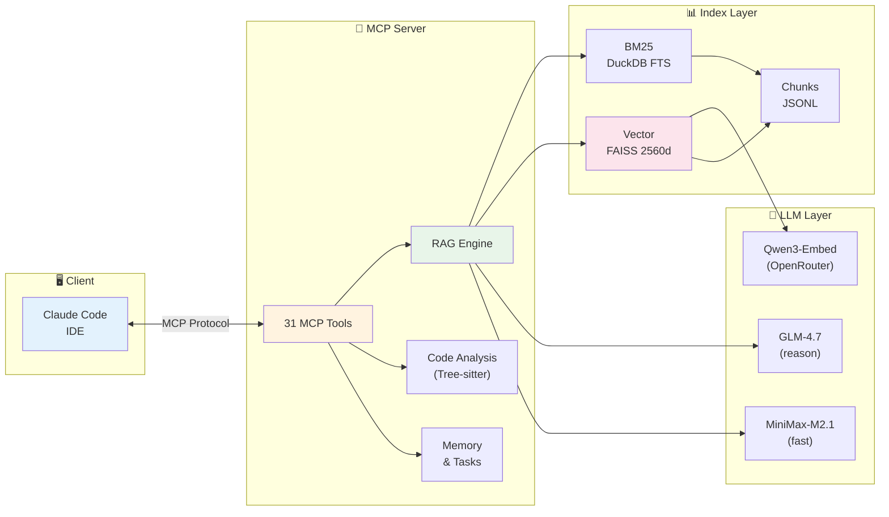
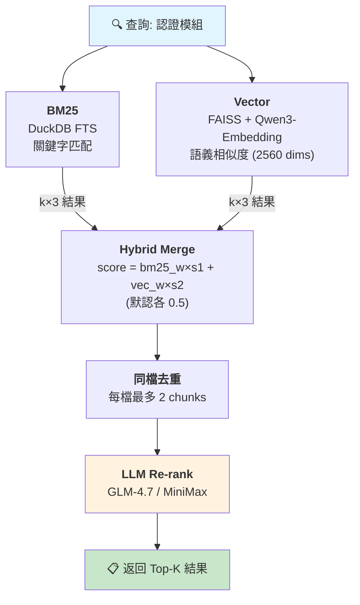

# augment-lite-mcp

> **Zero-Maintenance AI Code Assistant** - Local-first, cost-effective, privacy-safe

[](https://github.com/zoonderkins/augment-lite-mcp/releases)
[](https://opensource.org/licenses/MIT)
[](https://www.python.org/downloads/)
[](https://github.com/anthropics/mcp)

---

## 🎯 What is augment-lite-mcp?

augment-lite-mcp 是一個**零維護、本地優先**的 AI 代碼助手引擎，透過 MCP (Model Context Protocol) 整合到 Claude Code 等 AI 編程工具。

### 💡 核心價值

```
零維護搜索 + 本地隱私 + 低成本 AI = 理想的編程助手
```

- **🔥 Zero Maintenance**: 自動增量索引，無需手動重建
- **🔒 Privacy First**: 代碼完全本地存儲（DuckDB + SQLite）
- **💰 Cost Effective**: 本地 BM25+Vector 優先，LLM 僅用於精篩
- **🎯 Hybrid Search**: BM25 關鍵字 + 向量語義雙重匹配

### 🏗️ 系統架構



---

## ✨ 核心特性

### 1. 🚀 Auto-Incremental Indexing
**acemcp-inspired 零維護體驗**

```bash
# 不需要手動 rebuild，一切自動完成
./scripts/manage.sh add auto .  # 初次添加專案

# 之後無論如何修改代碼
# 搜索時自動檢測變更並更新索引
```

- ✅ 自動檢測文件變更（mtime + MD5）
- ✅ 只更新變更的文件（60x faster）
- ✅ 完全透明，用戶無感知

### 2. 🔍 Dual-Layer Retrieval
**本地向量 + 遠端 LLM 智能過濾**

```
Layer 1: 向量嵌入 (OpenRouter API / 本地 fallback)
  → BM25 + Vector 混合搜索 (k×3 over-fetch)
  → ~50 個候選結果 → 同檔去重 → ~35 候選
  → 模型: qwen/qwen3-embedding-4b (2560 dims, API)
  → Fallback: all-MiniLM-L6-v2 (384 dims, 本地)

Layer 2: GLM-4.7 / MiniMax-M2.1 LLM 智能過濾
  → 語義理解 + Re-rank
  → 最終 Top-K 高質量結果
  → 使用 OpenAI 兼容格式 API
```

**優勢**:
- 本地優先：BM25+Vector 在本地完成，無 API 成本
- LLM 精篩：僅對候選結果調用 LLM，減少 token 消耗
- 可選降級：Vector 未安裝時自動 fallback 到純 BM25

**模型選擇**: 支持多種嵌入模型，詳見 [Vector Models 比較](docs/core/COMPARISON.md#vector-embedding-models-比較)

#### BM25 + Vector 技術細節



| 組件 | 實現 | 特點 |
|------|------|------|
| **BM25** | DuckDB FTS | 精確關鍵字匹配、零延遲 |
| **Vector** | FAISS + sentence-transformers | 語義理解、跨語言 |
| **Hybrid** | 加權融合 | 兼顧精確性和語義 |

#### 技術參數配置

| 參數類別 | 配置 | 說明 |
|----------|------|------|
| **向量庫** | FAISS (`IndexFlatIP`) | 內積索引 + L2 normalize = cosine similarity |
| **Embedding** | `qwen/qwen3-embedding-4b` (2560 dims) | OpenRouter API，fallback 到本地 384 dims |
| **維度檢查** | ✅ Fail-fast | API 返回非預期維度時直接報錯 |
| **Chunk (Code)** | 50 行 / 10 行重疊 | `.py`, `.js`, `.go`, `.rs` 等 50+ 種副檔名 |
| **Chunk (Docs)** | 256 tokens / 32 tokens 重疊 | `.md`, `.txt`, `.rst`, `.html` 等 |
| **TopK (hybrid)** | **k×3** (BM25 + Vector 各取 3 倍) | 合併後同檔去重再 re-rank |
| **同檔去重** | ✅ 每檔最多保留 2 個 chunk | 平衡 recall 與去冗餘 |
| **最大檔案** | 1 MB | 超過自動跳過 |

<details>
<summary>📊 查詢流程示意 (v1.3.3+)</summary>

```
BM25: k*3 = 30 結果
Vector: k*3 = 30 結果
       ↓ 合併去重 (by source)
    ~50-60 候選
       ↓ 同檔去重 (每檔最多 2 個 chunk)
    ~35-50 候選
       ↓ Re-rank (LLM subagent)
    返回 top-10
```
</details>

<details>
<summary>📁 支援的檔案類型 (70+ 種)</summary>

**Code** (line-based chunking):
- Python: `.py`, `.pyw`, `.pyi`, `.pyx`
- JavaScript/TypeScript: `.js`, `.jsx`, `.ts`, `.tsx`, `.mjs`, `.cjs`
- Go: `.go` | Rust: `.rs` | Java: `.java` | Kotlin: `.kt`, `.kts`
- C/C++: `.c`, `.h`, `.cpp`, `.cc`, `.hpp`, `.hxx`
- C#: `.cs` | Ruby: `.rb` | PHP: `.php` | Swift: `.swift`
- Shell: `.sh`, `.bash`, `.zsh` | SQL: `.sql`
- Config: `.yaml`, `.yml`, `.toml`, `.json`, `.ini`
- Web: `.vue`, `.svelte`, `.css`, `.scss`
- Infra: `.tf`, `.hcl`, `.dockerfile`, `.proto`

**Docs** (token-based chunking):
- `.md`, `.markdown`, `.txt`, `.rst`, `.html`, `.adoc`, `.org`, `.tex`
</details>

**Fallback 機制**：
- Vector 依賴未安裝 → 自動降級為純 BM25
- Vector 索引不存在 → 自動降級為純 BM25

### 3. 📁 Multi-Project Management
**彈性專案組織**

```bash
# 三種方式指定專案
./scripts/manage.sh add myproject /path/to/project  # 名稱
./scripts/manage.sh rebuild 45d8fb52                # ID (8 字元)
./scripts/manage.sh add auto .                      # 自動偵測

# Claude Code 自動使用當前工作目錄專案
# 無需手動切換
```

### 4. 💾 Advanced Caching
**多層快取架構**

- **精確快取** (SQLite): 完全匹配的查詢直接返回
- **語義快取** (FAISS): 相似查詢 cosine similarity 匹配
- **LLM 快取**: API 回應快取（減少重複調用）

**優勢**: 重複查詢即時返回，無需重新計算

### 5. 🧠 Memory & Tasks
**長期記憶 + 任務追蹤**

```python
# 長期記憶（跨會話持久化）
memory.set("api_key", "secret_value", project="myproject")
memory.get("api_key")

# 任務管理
task.add("Implement feature X", priority=10)
task.list(status="in_progress")
```

### 6. 🌐 Web UI (v0.7.0)
**專業管理界面**

```bash
cd web_ui && ./start.sh  # http://localhost:8080
```

- ✅ 實時日誌流（WebSocket）
- ✅ 交互式搜索測試
- ✅ 專案儀表板
- ✅ 現代化深色主題

### 7. 🤖 MCP Protocol Compliance
**31 個 MCP Tools**

| 類別 | Tools |
|------|-------|
| **RAG** | `rag.search`, `answer.generate`, `answer.accumulated`, `answer.unified` |
| **Dual Search** | `dual.search` |
| **Project** | `project.init`, `project.status` |
| **Index** | `index.status`, `index.rebuild` |
| **Cache** | `cache.clear`, `cache.status` |
| **Memory** | `memory.get`, `memory.set`, `memory.delete`, `memory.list`, `memory.clear` |
| **Tasks** | `task.add`, `task.list`, `task.update`, `task.get`, `task.delete`, `task.resume`, `task.current`, `task.stats` |
| **Code** | `code.symbols`, `code.find_symbol`, `code.references` |
| **Search** | `search.pattern` |
| **File** | `file.read`, `file.list`, `file.find` |

### 8. 🔄 Unified Search (v1.3.2+)
**auggie + augment-lite 多引擎編排**

```
┌─────────────────────────────────────────────────────────────┐
│               answer.unified (指揮官工具)                    │
│                                                              │
│  1. [minimax-m2.1] 分解查詢 → sub_queries                   │
│  2. 返回執行計劃給 Claude                                    │
└──────────────────────┬──────────────────────────────────────┘
                       ↓
┌─────────────────────────────────────────────────────────────┐
│              Claude 按計劃自動執行                           │
│                                                              │
│  Step 1: auggie-mcp → semantic_results                      │
│  Step 2: rag.search [minimax re-rank] → rag_results         │
│  Step 3-N: rag.search (sub-queries) → more_results          │
│  Step N+1: 合併 evidence → [GLM-4.7] → final_answer         │
└─────────────────────────────────────────────────────────────┘
```

| Tool | 觸發時機 | 模型調用 |
|------|----------|----------|
| `answer.accumulated` | 複雜問題、之前返回"不知道" | minimax (分解) → GLM-4.7 (答案) |
| `answer.unified` | 需要 auggie + augment-lite 雙引擎 | minimax (分解) + auggie + GLM-4.7 |
| `dual.search` | 僅需搜索結果，不需答案生成 | minimax (re-rank) |

**Auto-Rebuild 功能 (v1.3.2+)**

當 `dual.search` 偵測到 auggie 返回的檔案 >50% 不在 augment-lite 結果中，自動觸發 `incremental_index` 重建並重新搜索：

```json
{
  "index_rebuilt": true,
  "rebuild_info": {
    "files_updated": 15,
    "reason": "auggie found files missing from augment-lite index"
  }
}
```

| 參數 | 預設 | 說明 |
|------|------|------|
| `auto_rebuild` | `true` | 自動重建過時索引 |

---

## 📦 快速開始

### 安裝

```bash
# 1. Clone repository
git clone https://github.com/zoonderkins/augment-lite-mcp.git
cd augment-lite-mcp

# 2. 安裝依賴 (使用 uv)
uv venv .venv
source .venv/bin/activate
uv pip install -r requirements.txt

# 或使用標準 Python
# python3 -m venv .venv && source .venv/bin/activate
# pip install -r requirements.txt

# 3. 配置 API Keys
cp .env.example .env
# 編輯 .env 填入必需的 API Keys:
#   - GLM_API_KEY (從 z.ai 獲取)
#   - MINIMAX_API_KEY (從 minimax.io 獲取)
#   - OPENROUTER_API_KEY (從 openrouter.ai/keys 獲取) - 用於 Embedding

# 4. (可選) 安裝向量搜索依賴 (~2GB)
bash scripts/install_vector_deps.sh

# 5. 添加專案並建立索引
./scripts/manage.sh add auto .
```

### 配置 MCP

#### 方式 1: Claude MCP CLI（推薦）

```bash
# 使用 Claude MCP CLI 一鍵配置
claude mcp add --scope user --transport stdio augment-lite \
  --env AUGMENT_DB_DIR="$HOME/augment-lite-mcp/data" \
  --env GLM_API_KEY="your-glm-api-key" \
  --env MINIMAX_API_KEY="your-minimax-api-key" \
  --env OPENROUTER_API_KEY="your-openrouter-api-key" \
-- "$HOME/augment-lite-mcp/.venv/bin/python" \
     "-u" "$HOME/augment-lite-mcp/mcp_bridge_lazy.py"
```


#### 方式 2: 手動配置 JSON

編輯 `~/.claude/config.json`:

```json
{
  "mcpServers": {
    "augment-lite": {
      "command": "/absolute/path/to/.venv/bin/python",
      "args": ["-u", "/absolute/path/to/mcp_bridge_lazy.py"],
      "env": {
        "AUGMENT_DB_DIR": "/absolute/path/to/data",
        "GLM_API_KEY": "your-glm-api-key",
        "MINIMAX_API_KEY": "your-minimax-api-key",
        "OPENROUTER_API_KEY": "your-openrouter-api-key"
      }
    }
  }
}
```

**環境變量說明**:

| 變量 | 必需 | 說明 |
|------|------|------|
| `AUGMENT_DB_DIR` | ✅ | 數據目錄（索引、快取、記憶） |
| `GLM_API_KEY` | ✅ | GLM-4.7 原廠 API Key (從 z.ai 獲取) |
| `MINIMAX_API_KEY` | ✅ | MiniMax-M2.1 原廠 API Key (從 minimax.io 獲取) |
| `OPENROUTER_API_KEY` | ✅ | OpenRouter API Key (從 openrouter.ai/keys 獲取) - 用於 Embedding |

> **Embedding 說明**: 使用 OpenRouter 調用 `qwen/qwen3-embedding-4b` (2560 維)。若未設定 `OPENROUTER_API_KEY`，自動 fallback 到本地 `all-MiniLM-L6-v2` (384 維)。

#### 方式 3: 本地代理模式 (可選)

如需使用 [claude-code-proxy](https://github.com/anthropics/claude-code-proxy) 本地代理:

```json
{
  "env": {
    "GLM_LOCAL_BASE_URL": "http://127.0.0.1:8082/v1",
    "GLM_LOCAL_API_KEY": "dummy",
    "GLM_LOCAL_MODEL_ID": "GLM-4.7",
    "MINIMAX_LOCAL_BASE_URL": "http://127.0.0.1:8083/v1",
    "MINIMAX_LOCAL_API_KEY": "dummy",
    "MINIMAX_LOCAL_MODEL_ID": "MiniMax-M2.1"
  }
}
```

然後修改 `config/models.yaml` 的 routes 使用 `glm-local` / `minimax-local`

### 使用

```python
# 在 Claude Code 中
# AI 會自動使用 augment-lite MCP tools

# 搜索代碼
"幫我找到處理用戶登錄的代碼"

# 生成答案（帶引用）
"如何配置資料庫連接？"

# 管理任務
"添加任務：重構認證模組"
```

---

## 🚀 首次初始化

當你在專案目錄首次執行 Claude CLI 時，augment-lite 會自動：

```
1. 專案偵測
   └─ 自動識別當前工作目錄為專案

2. 索引建立 (離線)
   ├─ BM25 索引 (DuckDB) - 關鍵字搜索
   └─ 向量索引 (FAISS) - 語義搜索 (可選)

3. 快取初始化
   ├─ 精確快取 (SQLite)
   └─ 語義快取 (FAISS)

4. 記憶體初始化
   └─ 長期記憶 (SQLite)
```

**手動初始化：**
```bash
./scripts/manage.sh add auto .
```

---

## 🔄 執行邏輯流程

### Auto-Init + Auto-Index 完整流程

當你執行任何 RAG 操作時（如 `rag.search`），augment-lite 會自動處理：

```
┌─────────────────────────────────────────────────────────┐
│                    用戶執行 rag.search                    │
└─────────────────────────┬───────────────────────────────┘
                          │
                          ▼
┌─────────────────────────────────────────────────────────┐
│              resolve_auto_project()                      │
│  優先級: 1.目錄名匹配 2.路徑匹配 3.active專案 4.None     │
└─────────────────────────┬───────────────────────────────┘
                          │
              ┌───────────┴───────────┐
              │                       │
         專案已註冊              專案未註冊
              │                       │
              │                       ▼
              │         ┌─────────────────────────┐
              │         │      AUTO-INIT          │
              │         │  - 消毒目錄名為專案名    │
              │         │  - 註冊到 projects.json │
              │         │  - 設為 active          │
              │         └───────────┬─────────────┘
              │                     │
              └──────────┬──────────┘
                         │
                         ▼
┌─────────────────────────────────────────────────────────┐
│              auto_index_if_needed()                      │
│               檢測文件變更                                │
└─────────────────────────┬───────────────────────────────┘
                          │
              ┌───────────┴───────────┐
              │                       │
          有索引狀態             無索引狀態
              │                       │
              ▼                       ▼
     ┌────────────────┐      ┌────────────────┐
     │  增量更新       │      │  全量建立       │
     │  只處理變更文件  │      │  所有文件視為   │
     │  (mtime+MD5)   │      │  "added"       │
     └────────┬───────┘      └────────┬───────┘
              │                       │
              └───────────┬───────────┘
                          │
                          ▼
┌─────────────────────────────────────────────────────────┐
│                     執行搜索                             │
│  BM25 + Vector 混合 → LLM 智能過濾 → 返回結果            │
└─────────────────────────────────────────────────────────┘
```

### 關鍵特性

| 特性 | 說明 |
|------|------|
| **零配置** | 無需手動 `project.init`，首次搜索自動初始化 |
| **零維護** | 自動檢測文件變更，增量更新索引 |
| **智能消毒** | 目錄名中的 `.` 等特殊字符自動替換為 `-` |
| **自動激活** | 新專案自動設為 active，無需手動切換 |

### 執行順序

```bash
# 傳統方式 (仍支持)
project.init → index.rebuild → rag.search

# 新方式 (推薦)
rag.search  # 自動處理 init + index
```

---

## 🔧 功能說明

### RAG 功能 (離線)

| Tool | 說明 | 用法 |
|------|------|------|
| `rag.search` | BM25 + 向量混合搜索 | 搜索代碼片段 |
| `answer.generate` | 基於檢索結果生成答案 | 帶引用的回答 |
| `answer.accumulated` | 多輪累積 evidence 問答 | 複雜問題、避免"不知道" |
| `answer.unified` | auggie + augment-lite 編排 | 返回執行計劃讓 Claude 按序調用 |
| `dual.search` | 雙引擎搜索 | 本地 RAG + auggie hint |
| `index.rebuild` | 重建專案索引 | 索引損壞時使用 |
| `index.status` | 檢查索引狀態 | 查看索引健康度 |

### 代碼分析功能 (Serena 類似) - Tree-sitter 多語言支援

| Tool | 說明 | 範例 |
|------|------|------|
| `code.symbols` | 獲取代碼符號概覽 | 列出類、函數、方法 |
| `code.find_symbol` | 查找符號定義 | 找到 `MyClass` 定義位置 |
| `code.references` | 查找符號引用 (AST) | 找到所有使用 `my_func` 的地方 |
| `search.pattern` | 正則模式搜索 | `def.*search` 匹配 |
| `file.read` | 讀取文件內容 | 支持行範圍 |
| `file.list` | 列出目錄內容 | 支持 glob 過濾 |
| `file.find` | 查找文件 | `**/*.py` 模式 |

**支援語言** (v1.3.0+, Tree-sitter):
```
Python, JavaScript, TypeScript, Go, Rust, Bash,
JSON, YAML, HTML, CSS, HCL (Terraform), TOML
```

### 記憶與任務

| Tool | 說明 |
|------|------|
| `memory.get/set/delete/list` | 長期記憶管理 |
| `task.add/list/update/delete` | 任務追蹤 |
| `project.init/status` | 專案管理 |
| `cache.clear/status` | 快取管理 |

### 🧠 Memory 使用模式（Serena-style）

AI 會**主動**在以下情況自動存儲 Memory：

| 觸發條件 | 建議 Key | 內容範例 |
|----------|----------|----------|
| 首次交互 | `project_overview` | 專案名稱、版本、用途、核心模組 |
| 偵測到代碼風格 | `code_style` | ruff, 100 chars, Python 3.12+ |
| 讀取 README/docs | `suggested_commands` | setup, build, test 命令 |
| 用戶解釋架構 | `architecture_decisions` | 微服務、GraphQL、Redis 快取 |
| 用戶提到部署 | `deployment_notes` | Docker, K8s, 環境變數 |
| 發現 Bug 模式 | `known_issues` | 常見錯誤、workaround |

**標準 Memory Keys:**
```
project_overview          # 專案概覽
code_style                # 代碼風格
suggested_commands        # 常用命令
architecture_decisions    # 架構決策
api_conventions           # API 規範
deployment_notes          # 部署筆記
known_issues              # 已知問題
task_completion_checklist # 完成清單
```

---

## 🔌 Auggie MCP 整合（可選）

**節省 Token + 提升語義準確度**

augment-lite 可與 [Auggie MCP](https://docs.augmentcode.com/context-services/mcp/quickstart-claude-code) 協同工作：

```
┌──────────────────────────────────────────────────────────┐
│                    Claude Code                            │
└─────────────────┬────────────────────────────────────────┘
                  │
     ┌────────────┴────────────┐
     │                         │
┌────▼────────┐          ┌────▼────────┐
│ augment-lite│          │  auggie-mcp │
│ (BM25 RAG)  │          │ (Semantic)  │
└─────────────┘          └─────────────┘
     │                         │
     └──────────┬──────────────┘
                │
        ┌───────▼───────┐
        │  Results 合併  │
        │  去重 + 排序   │
        └───────────────┘
```

### 安裝 Auggie MCP

```bash
# 1. 安裝 auggie CLI
npm install -g @augmentcode/auggie@latest

# 2. 登入（需要 Augment Code 帳號）
auggie login

# 3. 添加到 Claude Code
claude mcp add-json auggie-mcp --scope user '{"type":"stdio","command":"auggie","args":["--mcp"]}'
```

### 使用模式

| 模式 | 說明 | Token 消耗 |
|------|------|-----------|
| **僅 augment-lite** | BM25 + Vector 本地搜索 | 低 |
| **僅 auggie-mcp** | Augment 語義引擎 | 最低 |
| **混合模式（推薦）** | augment-lite 初篩 + auggie 精篩 | 中 |

### 推薦工作流

```
1. 用戶查詢 "找到認證模組"
2. augment-lite rag.search → 獲得 20 個候選
3. auggie-mcp codebase-retrieval → 語義排序
4. Claude 合併結果 → 返回最相關 5 個
```

> **無 Auggie 時的 Fallback**：augment-lite 使用內建 LLM 過濾（GLM-4.7/MiniMax），仍可獨立運作

### 🛡️ Guardrails (v1.2.0)

| 模組 | 功能 | 說明 |
|------|------|------|
| `prompt_injection` | 提示注入檢測 | 防止指令覆蓋、角色劫持、越獄攻擊 |
| `pii_detection` | PII/敏感數據檢測 | 郵箱、電話、SSN、API Key、JWT |
| `code_security` | 代碼安全掃描 | SQL注入、XSS、命令注入、OWASP Top 10 |
| `hallucination` | 幻覺檢測 | 驗證回答是否基於提供的證據 |
| `context_grounding` | 上下文根基 | 確保回答不超出提供的上下文 |
| `schema_validation` | 輸出驗證 | JSON schema 驗證、MCP 輸出格式 |

---

## 🔑 環境變數

### 必需

| 變數 | 說明 | 獲取 |
|------|------|------|
| `GLM_API_KEY` | GLM-4.7 原廠 API Key | [z.ai](https://z.ai) |
| `MINIMAX_API_KEY` | MiniMax-M2.1 原廠 API Key | [minimax.io](https://minimax.io) |

### 可選

| 變數 | 說明 | 預設值 |
|------|------|--------|
| `AUGMENT_DB_DIR` | 數據目錄 | `./data` |

### 本地代理 (可選)

如需使用 claude-code-proxy：

| 變數 | 說明 |
|------|------|
| `GLM_LOCAL_BASE_URL` | `http://127.0.0.1:8082/v1` |
| `GLM_LOCAL_API_KEY` | `dummy` |
| `MINIMAX_LOCAL_BASE_URL` | `http://127.0.0.1:8083/v1` |
| `MINIMAX_LOCAL_API_KEY` | `dummy` |

---

## 🏗️ 架構概覽

```
┌──────────────────────────────────────────────┐
│            Claude Code (AI Assistant)         │
└─────────────────┬────────────────────────────┘
                  │ MCP Protocol
┌─────────────────▼────────────────────────────┐
│         mcp_bridge_lazy.py (31 Tools)        │
└─────────────────┬────────────────────────────┘
                  │
     ┌────────────┼────────────┐
     │            │            │
┌────▼─────┐  ┌──▼──────┐  ┌─▼────────┐
│ Retrieval│  │  Cache  │  │  Memory  │
│ (BM25+   │  │ (3-Layer│  │ (SQLite) │
│  Vector) │  │  Cache) │  └──────────┘
└────┬─────┘  └─────────┘
     │
┌────▼─────────────────────────────────┐
│  Layer 1: API/Local Embeddings       │
│  - OpenRouter: qwen3-embedding-4b    │
│  - Fallback: sentence-transformers   │
│  - BM25 + FAISS hybrid search        │
│  - 50 candidates                     │
└────┬─────────────────────────────────┘
     │
┌────▼─────────────────────────────────┐
│  Layer 2: Remote LLM Re-ranking      │
│  - GLM-4.7 / MiniMax-M2.1 (原廠)     │
│  - Smart filtering + deduplication   │
│  - Final 8 results                   │
└──────────────────────────────────────┘
```

### 🤖 Providers 配置 (全部原廠)

| Provider | Endpoint | Context | Max Output |
|----------|----------|---------|------------|
| **glm-4.7** | `api.z.ai/api/anthropic` | 200K | 128K |
| **minimax-m2.1** | `api.minimax.io/anthropic` | 200K | - |

### 📊 Routes 配置

| Route | Provider | Max Output | 觸發條件 |
|-------|----------|-----------|---------|
| `small-fast` | minimax-m2.1 | 2048 | lookup, small_fix |
| `general` | glm-4.7 | 4096 | general tasks |
| `reason-large` | glm-4.7 | 8192 | refactor, reason |
| `big-mid` | glm-4.7 | 8192 | tokens > 200K |
| `long-context` | glm-4.7 | 8192 | tokens > 400K |
| `ultra-long-context` | glm-4.7 | 16384 | 超長上下文 |
| `fast-reasoning` | minimax-m2.1 | 4096 | 快速推理 |

---

## 🎯 支援的功能

### ✅ 已實現

- [x] Auto-incremental indexing (零維護)
- [x] Dual-layer retrieval (本地+遠端)
- [x] Multi-project management (名稱/ID/auto)
- [x] Three-layer caching (精確+語義+Provider)
- [x] Long-term memory (global/project scope)
- [x] Task management (structured tracking)
- [x] Web UI (FastAPI + WebSocket)
- [x] MCP protocol compliance (28 tools)
- [x] AI auto-discovery (server instructions)
- [x] Gitignore filtering
- [x] Model-specific system prompts
- [x] Dynamic token limits
- [x] Guardrails (evidence citation)
- [x] Modern Guardrails (v1.2.0)
  - Prompt Injection Detection
  - PII/API Key Detection
  - Code Security Scanning (OWASP)
  - Hallucination Detection
  - Context Grounding Validation
  - Output Schema Validation

### 🚧 計劃中 (v1.4.0+)

#### 代碼理解增強

| 方案 | 功能 | 狀態 |
|------|------|------|
| **Tree-sitter** | AST 結構解析 (12 語言) | ✅ v1.3.0 已實現 |
| **修改型 Symbol 工具** | rename, edit_symbol_body | 🚧 v1.4.0 計劃中 |
| **LSP Bridge** | 完整語義分析 | 🚧 v1.5.0 計劃中 |
| **Auggie MCP** | 外部語義引擎 | 🚧 可選整合 |

**已完成 (v1.3.0)**:
- [x] **Tree-sitter 整合**: 12 語言 AST 解析
  - Python, JavaScript, TypeScript, Go, Rust, Bash
  - JSON, YAML, HTML, CSS, HCL (Terraform), TOML
- [x] **AST-based References**: `code.references` 使用 Tree-sitter 精準定位

**v1.4.0 計劃 (P85)**:
- [ ] **修改型 Symbol 工具** (Serena 核心差距)
  - `code.rename_symbol` - Scope-aware 安全重命名
  - `code.edit_symbol_body` - 精準替換 symbol 內容
  - `code.insert_before_symbol` / `code.insert_after_symbol`
  - 初期方案：AST-based Python-only 版本

**v1.5.0 計劃 (P80)**:
- [ ] **LSP → MCP Bridge**: 完整語義分析
  - rename (跨文件安全重構)
  - diagnostics (lint/errors)
  - code actions
  - 方案：整合 mcp-language-server 或自建 LSP client wrapper

**研究中 (P70)**:
- [ ] **Auggie MCP 深度整合**: 評估可否作為 LSP 替代
  - 安裝: `npm install -g @augmentcode/auggie@latest && auggie login`
  - 配置: `claude mcp add-json auggie-mcp --scope user '{"type":"stdio","command":"auggie","args":["--mcp"]}'`

#### 其他計劃

- [ ] Multi-language embeddings (multilingual-e5-large)
- [ ] Code-specific embeddings (CodeBERT, UniXcoder)
- [ ] GraphRAG integration (code dependency graphs)
- [ ] Incremental vector index updates
- [ ] Cloud deployment options (Docker Compose)
- [ ] VSCode extension (alternative to MCP)
- [ ] Monitoring dashboard (metrics, usage stats)
- [ ] Plugin system (custom tools)

---

## 📊 效能特點

| 特點 | 說明 |
|------|------|
| **Indexing** | DuckDB BM25 批量索引，支援大型代碼庫 |
| **Incremental** | 只更新變更文件，避免全量重建 |
| **Local First** | BM25+Vector 本地計算，無 API 延遲 |
| **LLM 精篩** | 僅候選結果送 LLM，減少 token 消耗 |
| **Cache** | 重複查詢直接返回，無計算開銷 |

---

## 📊 競品比較

想了解 augment-lite-mcp 與其他方案的差異？

- **vs Anthropic @modelcontextprotocol/context**: [查看對比](docs/core/COMPARISON.md#augment-lite-mcp-vs-anthropic-官方-context-providers)
- **vs acemcp**: [查看對比](docs/core/COMPARISON.md#1-augment-lite-mcp-vs-acemcp)
- **vs Augment Code**: [查看對比](docs/core/COMPARISON.md#2-augment-lite-mcp-vs-augment-code-proprietary)
- **vs Qdrant/Weaviate**: [查看對比](docs/core/COMPARISON.md#3-augment-lite-mcp-vs-qdrantweaviate-vector-dbs)
- **Vector Models 選擇指南**: [查看詳情](docs/core/COMPARISON.md#vector-embedding-models-比較)

---

## 🙏 致謝與靈感來源

### 主要靈感來源

- **[acemcp](https://github.com/wxxedu/acemcp)** by @wxxedu
  - 💡 Auto-incremental indexing 實現方式
  - 💡 Zero-maintenance 哲學
  - 💡 Web UI 設計靈感

- **[Augment Code](https://www.augmentcode.com/)** (Proprietary)
  - 💡 Context Engine 架構洞察
  - 💡 Two-stage retrieval (local + remote) 概念

- **[@modelcontextprotocol/context](https://github.com/modelcontextprotocol/servers)** by Anthropic
  - 💡 MCP 協議標準參考
  - 💡 簡潔高效的文件訪問設計

### 技術棧感謝

- **[sentence-transformers](https://www.sbert.net/)** by Hugging Face
  - all-MiniLM-L6-v2 嵌入模型
  - 本地、免費、高質量

- **[Requesty.ai](https://requesty.ai/)**
  - 多模型聚合平台
  - 300+ 模型統一 API

- **[DuckDB](https://duckdb.org/)** - 嵌入式 SQL 資料庫
- **[FAISS](https://github.com/facebookresearch/faiss)** (Meta) - 向量相似度搜索
- **[FastAPI](https://fastapi.tiangolo.com/)** - 現代 Web 框架
- **[Claude Code](https://www.anthropic.com/)** - MCP 協議與開發工具

---

## 📝 文檔

### 用戶文檔 (可選安裝)

```bash
# docs/ 目錄包含完整文檔（已加入 .gitignore）
# 如需閱讀，可在本地查看或在線生成
```

- `docs/guides/` - 使用指南
  - MCP Setup, Multi-Project, Vector Search, Cache, Memory, Tasks
- `docs/features/` - 功能說明
- `docs/core/` - 架構與技術概覽
- `docs/bugfixes/` - Bug 修復記錄

### 開發者文檔 (內部參考)

- `init/specs/` - 技術規格
- `init/guidelines/` - 編碼標準、命名規範、文檔指引
- `init/workflows/` - 發布、修復、功能開發流程

### 測試

```bash
# 快速環境檢查
./health_check.sh

# 完整測試套件
python tests/run_all_tests.py

# 單獨測試
python tests/test_high_priority_apis.py
```

詳見 [TESTING.md](TESTING.md)

---

## 🤝 貢獻

歡迎貢獻！請遵循以下流程：

1. Fork 本倉庫
2. 創建功能分支 (`git checkout -b feature/AmazingFeature`)
3. 提交變更 (`git commit -m 'Add some AmazingFeature'`)
4. 推送到分支 (`git push origin feature/AmazingFeature`)
5. 開啟 Pull Request

詳見 `init/workflows/RELEASE_WORKFLOW.md` 和 `init/guidelines/CODING_STANDARDS.md`

---

## 📄 授權

本專案採用 MIT License - 詳見 [LICENSE](LICENSE) 文件

---

## 🔗 相關連結

- **Repository**: https://github.com/zoonderkins/augment-lite-mcp
- **Issues**: https://github.com/zoonderkins/augment-lite-mcp/issues
- **Changelog**: [CHANGELOG.md](CHANGELOG.md)
- **MCP Protocol**: https://github.com/anthropics/mcp

---

## 💬 社群與支援

- GitHub Issues: 報告 bug 或功能請求
- Discussions: 提問或分享使用經驗

---

**Made with ❤️ by the community**

*Inspired by acemcp, Augment Code, and the open-source AI community*
